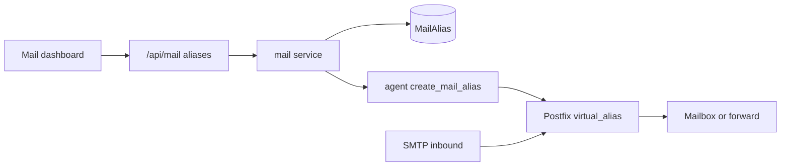

# Mail features: available vs missing

Stack today: **Postfix + Dovecot Maildir** (system mail), panel webmail reads Maildir directly (JSON fallback for dev). Not a custom SMTP receiver.

## What you already have

| Area | Status | Notes |
|------|--------|--------|
| 1. Sending (SMTP) | Partial | Authenticated SMTP via Postfix/Dovecot SASL; webmail send via `sendmail`; attachments in webmail. Queue/retry is Postfix’s, **no panel queue UI**. |
| 2. Receiving | Yes | Postfix → Dovecot LMTP → Maildir. |
| 3. Mailbox mgmt | Partial | Create/delete/reset/lock accounts; folders in webmail. **Quota stored but not enforced**. |
| 4. Access | Yes | IMAP/IMAPS, POP3/POP3S, browser webmail (`/webmail`, mailbox UI). |
| 5. Auth | Partial | Password for IMAP/POP3/SMTP + webmail; failed-login lockout. **No mail OAuth/SSO; no mail-specific 2FA** (panel user 2FA is separate). |
| 6. Spam | Missing | Junk folder + manual move only. No Rspamd/SpamAssassin. |
| 7. Security | Partial | TLS on mail host; **SPF** in DNS. **No DKIM signing, no DMARC DNS, no antivirus**. |
| 8. Addresses | Stub | Prisma `MailAlias` + typed agent action `create_mail_alias` exist; **no agent allowlist, Postfix maps, API, or UI**. No catch-all / groups. |
| 9. Search/storage | Partial | Maildir + backups of `/var/mail/vhosts`. **No FTS search, no archive policy**. |
| 10. Admin | Partial | Install/start/stop Postfix/Dovecot; shell diagnose scripts. **No queue/delivery-log UI**. |

Key files: [`src/lib/services/mail.ts`](src/lib/services/mail.ts), [`agent/mail.ts`](agent/mail.ts), [`scripts/install-mail.sh`](scripts/install-mail.sh), [`src/app/dashboard/mail/page.tsx`](src/app/dashboard/mail/page.tsx), [`src/app/mailbox/[accountId]/page.tsx`](src/app/mailbox/[accountId]/page.tsx), [`prisma/schema.prisma`](prisma/schema.prisma) (`MailDomain` / `MailAccount` / `MailAlias`).

## Explicitly out of first build (unless you ask)

- OAuth/SSO for mailbox login
- Mailbox-level 2FA
- Distribution groups (mailing lists)
- Full-text search / indexing product
- Long-term archiving product
- Virus scanning (can follow spam phase)

## Phased implementation (recommended)

### Phase 1 — Aliases, forwarding, catch-all (highest panel value)

Prisma already has `MailAlias { alias, forwardTo }`.

1. Agent: implement `create_mail_alias` / `delete_mail_alias`; maintain Postfix `virtual_alias_maps` (hash or sqlite/regexp).
2. Catch-all: `@domain` → target mailbox (Postfix catchall map), panel flag per domain.
3. Service + Next.js API under `/api/mail` (or `/api/mail/aliases`).
4. Mail dashboard UI: list/create/delete aliases; optional “forward-only” vs alias-to-mailbox.
5. Domain-access feature key remains `mail`.

### Phase 2 — DKIM + DMARC

1. Install/configure OpenDKIM (or OpenDKIM via agent package install).
2. Per-domain key generate on mail host setup; publish `selector._domainkey` TXT via existing DNS zone sync.
3. Add DMARC TXT (`_dmarc`) with sensible default (`p=none` then upgrade guidance).
4. Wire Postfix `milter` / OpenDKIM; verify with diagnose script.

### Phase 3 — Quota enforcement

1. Write Dovecot quota config from `MailAccount.quotaMb`.
2. Show used/limit in Mail UI (du of Maildir or doveadm).

### Phase 4 — Admin queue + logs

1. Agent actions: `mail_queue_list`, `mail_queue_flush`, `mail_queue_delete`, `mail_log_tail`.
2. Admin-only dashboard section (Services or Mail).

### Phase 5 — Spam (optional heavy)

1. Rspamd + Postfix integration; train Junk from webmail moves later.
2. ClamAV after spam is stable.

## First deliverable when you say “implement”

**Phase 1 only** unless you pick another phase: working aliases/forwarding/catch-all in agent + API + Mail UI, without changing `Domain.userId` / ownership model.

